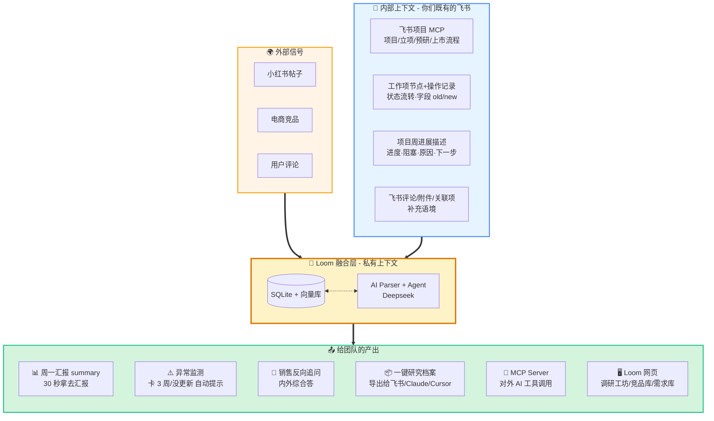
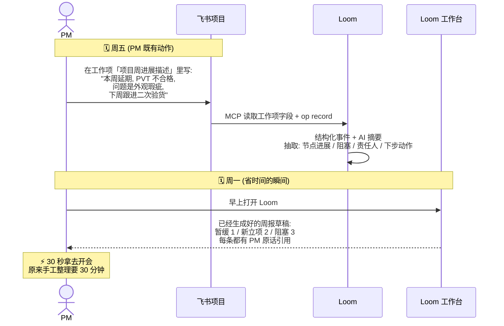
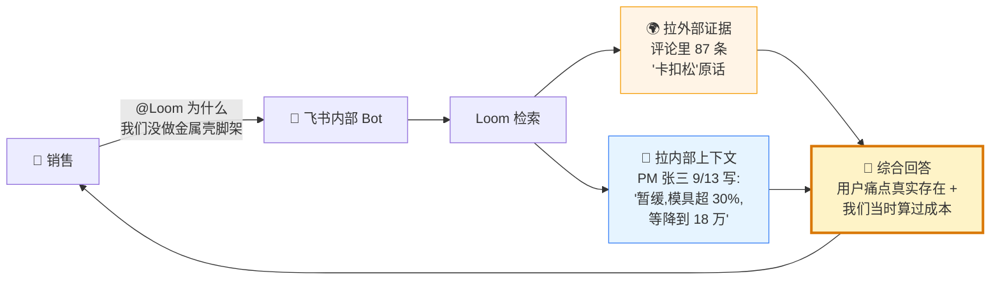

# Loom 架构总览（一眼看懂版）

> 给人看的版本。1 分钟读完即知系统全貌。
> 想看实施细节，去 [competition-roadmap.md](./competition-roadmap.md) / [ui-architecture.md](./ui-architecture.md) / [decision-chain.md](./decision-chain.md)。
>
> **2026-05-20 Round 7 更新**：当前 Ulanzi 产研流程优先接入 **飞书项目 MCP**，而不是先做多维表格 schema 适配。飞书项目已经提供标准工作项类型、节点流、字段配置、评论和操作记录；多维表格保留为补充源/兼容源。

---

## 一句话定义

**Loom 是把"外部用户声音"和"内部团队记忆"焊在一起的私有上下文层。**

外部用户在抱怨什么 + 我们公司内部讨论过怎么办——AI 第一次能同时看到两边。

---

## 🗺️ 系统全景图



**读图方法（3 个色块的含义）：**

| 🟧 橙色 | 🟦 蓝色 | 🟨 黄色 | 🟩 绿色 |
|---|---|---|---|
| 外部世界给你的信号 | 你们公司内部已有的工作流 | Loom 做的事（独有价值） | 团队真正消费的产物 |

**关键观察**：橙 + 蓝 是输入，黄是 Loom 自己的位置（融合层），绿是输出。**Loom 不替代任何左边的东西，只把左边焊在一起再衍生右边**。

---

## 💎 两个最关键的"价值时刻"

讲故事比讲架构有说服力。Loom 的价值集中在这两个时刻：

### 时刻 1：每周五写 → 周一拿现成汇报



**核心：PM 工作流零改动**——他周五本来就在写那段话，Loom 顺便读了。

---

### 时刻 2：销售反问 → 内外综合答



**核心：这是任何外部 SaaS 永远做不到的回答**——因为他们不知道你们公司内部说过什么。

---

## 🖥️ Loom 网页模块速览

```
┌─ Loom 网页 (左侧导航) ───────────────────────┐
│                                                │
│  🏠 工作台         ← 周一首屏看到现成汇报      │
│  🔍 调研工坊       ← PM 80% 时间在这           │
│  📊 需求库         ← 飞书项目镜像 + 品类分析   │
│  🏪 竞品库         ← 外部信号主仓库            │
│  📚 知识库         ← 历史 PRD/MRD              │
│  ⚙️  设置          ← 飞书集成 / 数据源         │
│                                                │
│  (没有"AI 聊天"模块——AI 对话全部去飞书)      │
└───────────────────────────────────────────────┘
```

每个详情页右上角有 **「💬 在飞书继续讨论」** 按钮——一键把当前页上下文送到飞书 bot 里继续聊。

---

## 🧭 全局原则（地基）

| 原则 | 意思 |
|---|---|
| 飞书项目是主源头 | 产研流程增删改永远在飞书项目做；Loom 只读 + 衍生 |
| 多维表格是补充源 | 只有飞书项目未覆盖的团队/流程才走多维表格适配 |
| AI 对话在飞书 | Loom web 不做聊天 UI；只做一次性 AI 操作按钮 + 飞书 handoff |
| PM 工作流零改动 | 不要求 PM 学新工具、填新字段、改新格式 |
| 关联即洞察 | 每个对象都显示关联——这是"内外打通"的可视化 |
| 导出优于内编 | PM 想带走的东西一键打包 |

---

## 💡 为什么这个架构有护城河

- **数据**：外部抓取 + 飞书项目流程记录 + 周进展 + PM 标注，越积越值钱
- **结构**：飞书项目标准字段/节点/操作记录先行；多维表格 AI schema 适配只做补充
- **网络效应**：团队越大，库越值钱，AI 越能站在前人肩膀上
- **AI 时代反而占优**：模型越强、越商品化，**私有上下文越值钱**——因为强模型 + 弱上下文还是写不出能用的 PRD

外部 SaaS 卖给所有人的数据是商品；团队累积的内部上下文才是只属于你们的资产。

---

*文档版本：v1 (2026-05-19)*
*这一份是给人看的总览；技术实施请看 [competition-roadmap.md](./competition-roadmap.md)*
