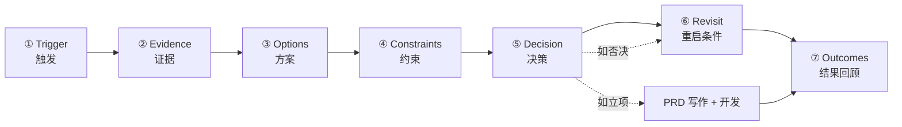

# 决策链路 (Decision Chain) 设计

本文档定义 Loom 怎么定义、捕捉、呈现"决策链路"——这是"内外打通"价值故事真正的核心载体。前面的 [competition-roadmap](./competition-roadmap.md) 和 [ui-architecture](./ui-architecture.md) 是地基；这份文档是把地基变成护城河的关键设计。

> **🚨 重要：本文档 §12 是当前实施真相（2026-05-20 round 7 重定向后）**
> §1-§10 是概念框架，描述 AI 内部应该怎么"理解"一个决策链路；保留给 AI parser 的 schema 用。
> **PM 不直接填这些阶段字段**——所有捕捉发生在 PM 既有的飞书项目/飞书表更新动作里。
> Codex 实施时以 §12 为准；§11 是上一轮 Bitable 方案，只保留给飞书项目未覆盖的补充源。

---

## 0. 为什么这件事是核心

回顾前面对话里你说的：
> "包括产品自己都会忘记当时这个为什么没有做"

这不是个孤立的痛点，**这就是 Loom 全部价值的源头**：

- 写 PRD 时没办法引用过往决策，因为决策没被记下来
- 销售问"为什么没做 X"答不上来，因为决策没被记下来
- 新 PM 重新踩同样的坑，因为决策没被记下来
- AI 写出来的东西宽泛，因为它不知道你们做过/否决过什么

**所以决策链路不是一个功能，是 Loom 这个产品存在的理由。**

之前我只提到"加 4 个字段记录决策"——这只是终点的快照，没有捕捉到链路。链路是过程，过程比终点更有价值。

---

## 1. 什么是"决策链路"——7 阶段框架

一个完整的产品决策包含这些阶段（不是每个决策都全跑一遍，但都该被识别）：



| 阶段 | 含义 | 典型问题 |
|---|---|---|
| ① Trigger 触发 | 什么信号让你开始考虑这件事 | "为什么这个需求会出现在桌面上？" |
| ② Evidence 证据 | 收集了哪些数据支持/反对 | "用户真的需要吗？竞品怎么做？" |
| ③ Options 方案 | 考虑了哪些做法 | "我们想过几种方案？" |
| ④ Constraints 约束 | 什么限制了选择 | "为什么不选其他方案？" |
| ⑤ Decision 决策 | 立项/暂缓/放弃 + 理由 | "最终决定是什么？谁拍的？" |
| ⑥ Revisit 重启条件 | 什么时候应该重新看 | "暂缓后什么情况下可以重启？" |
| ⑦ Outcomes 结果 | 实际上线后效果 | "我们当初想对了吗？" |

**对你们最重要的：**
- **② Evidence** — 你们的调研工坊本来就在做这件事 ✅
- **⑤ Decision** — WS-2 飞书表字段已规划 ✅
- **⑥ Revisit** — **完全缺失，但价值最高**（下面单独讲）
- **①③④** — 部分散落在 PM 脑子里 / 飞书群讨论里 / 调研备注里，没有结构化捕捉
- **⑦** — 长周期反馈，竞赛 demo 不强求，先留空

---

## 2. 当前捕捉状态盘点

| 阶段 | 现在哪里有 | 缺什么 |
|---|---|---|
| ① Trigger | 隐含在调研任务备注里 | 没有结构化字段；无法统计"团队 Q3 是被用户反馈触发的更多，还是被竞品动作触发的更多" |
| ② Evidence | ✅ 调研工坊有竞品/评论/分析 | OK |
| ③ Options | 散落在飞书群讨论 | 没有显式记录"我们当时考虑过 A/B/C 方案" |
| ④ Constraints | 散落在 PM 脑子里 | 决策理由里有一部分，但没有结构化 |
| ⑤ Decision | 计划中（WS-2） | 状态 + 理由 4 字段 |
| ⑥ Revisit | ❌ 完全没有 | **必须新增**——这是把"暂缓"从死信变成活信号的关键 |
| ⑦ Outcomes | ❌ 完全没有 | Phase 3 再考虑 |

---

## 3. ⭐ 重启条件 (Revisit Conditions) —— 被忽略的高价值字段

这是单拎出来强调的。所有 `暂缓 / 放弃` 决策都应该附带一个 **重启条件**：

**例子：**

> 需求：金属壳脚架
> 决策：暂缓
> 重启条件：
>   - ① 月销量预期 > 5,000 件 OR
>   - ② 模具成本报价降到 18 万以下 OR
>   - ③ 2026 Q3 主动重审

**为什么这一条价值高：**

1. **把死决策变成活信号**：暂缓不再是"忘了"，而是"等条件触发"
2. **可被自动监测**：后台 job 监测条件 → 触发 → 通知 PM 重新考虑
3. **回答"为什么不做"时更有说服力**：销售问起，答案不是"PM 当时觉得不行"而是"我们当时算过，要满足这两个条件之一才值得做"
4. **形成决策的"完成度"标准**：一个 `暂缓` 决策没填重启条件 = 这个决策是半成品

**录入方式（低摩擦）：**

PM 在飞书 bot @ 说 "暂缓 XX 需求，理由是模具成本超预算" 时，bot 追问一句：
> 收到。**什么条件下可以重启？** (例如"月销量预期 > X" / "成本降到 X 以下" / "Q3 重审" / "无")
> 回复一句话即可，可后续修改。

PM 回复 → 入库。**多了 1 次问答，但永久解决"为什么没做"的盲区。**

---

## 4. ⭐ 集成工作流：顺手捕捉模型

回到你的核心问题："**怎么跟我们现在的工作有机结合**？"

我的设计原则：**决策链路不是让 PM 额外去填一个东西，而是 PM 既有动作的副产品**。

下表是每个阶段在 PM 现有工作流的哪一步、用什么方式、被自动 / 半自动捕捉：

| 阶段 | PM 既有动作 | Loom 顺手做什么 | 摩擦 |
|---|---|---|---|
| ① Trigger | 创建调研任务时 | 调研任务表单加一项"触发来源"下拉框（评论涌现 / 竞品动作 / 销售反馈 / 主动选品 / 工厂建议 / 上层指派 / 其他）+ 一行说明（可空） | 极低（5 秒） |
| ② Evidence | PM 在调研工坊关联竞品/评论 | 已自动捕捉 | 0 |
| ③ Options | PM 在调研详情页 PM 私注里写 | AI 从私注中提取"我考虑了 X / Y / Z" 自动结构化（PM 不写也行，写了 AI 顺手抽） | 0 (复用已有动作) |
| ④ Constraints | 决策时一行理由 | 把"理由"字段做成 `tag 多选 + 一句话说明` 形式：[成本][工厂][品牌][时间][团队][战略][其他] + 自由文本 | 低 (多点 1-2 个 tag) |
| ⑤ Decision | 飞书表改状态 / 飞书 bot @ 命令 | 已规划（WS-2 + WS-4） | 已规划 |
| ⑥ Revisit | bot 追问一句 | "什么条件下重启？"一行回答 | 中 (多答 1 句，但价值最高) |
| ⑦ Outcomes | (Phase 3) 季度回顾 | 上线产品定期触发回顾问卷 | 暂不强求 |

### 三种典型场景的端到端

#### 场景 A：从信号到决策（完整链路）

```
[飞书评论涌现"卡扣松"]                     ← Trigger 信号
        │
        ▼
PM 在 Loom 创建调研任务                    ← ① 选 "评论涌现"
"XX 款脚架快拆改良"
        │
        ▼
Loom 自动拉竞品 / 评论 / 历史需求         ← ② Evidence (自动)
        │
        ▼
PM 在调研详情页写私注:                    ← ③ Options (PM 写的过程
"考虑了 A. 换供应商 B. 重开模具                 中 AI 抽取)
 C. 加固现有结构"
        │
        ▼
PM 一键导出研究档案                       ← 顺手弹出: "你打算怎么走？"
                                              PM 选 "暂缓"
        │
        ▼
Bot 追问 "重启条件？"                     ← ⑥ Revisit
PM 回 "月销量 > 5000 或 模具 < 18 万"
        │
        ▼
PM 选约束 tag [成本] + 写理由            ← ④ ⑤
"模具改造预算超 30%"
        │
        ▼
飞书表自动更新 + Loom 决策链路完整记录    ← 入库
```

#### 场景 B：销售反向触发的回放

```
[3 个月后，销售在飞书群问]:                ← 销售提问
"我们为什么没做金属壳脚架?"
        │
        ▼
飞书内部问答 bot 收到                     ← WS-5
        │
        ▼
Loom 检索"金属壳脚架"决策链路:           ← 拉完整链路
  - Trigger: 评论涌现 (87 条原话)
  - Evidence: 5 个竞品 + AI 痛点聚类
  - Options: PM 考虑了 3 种 (从私注抽取)
  - Constraints: [成本] [工厂]
  - Decision: 暂缓
  - Revisit: 月销量 > 5000 或 模具 < 18 万
        │
        ▼
Bot 回答:                                ← 内外打通的标志性场景
"我们 8 月份评估过，因为模具成本超预算
 30% 暂缓了。重启条件是: ① 月销预期>5000
 ② 模具报价<18万。
 用户痛点确实存在 (引用 87 条评论)，
 PM 当时考虑过换供应商/重开模具/加固
 三种方案。"
```

#### 场景 C：重启条件自动触发

```
[采购小组发现新模具供应商, 报价 17 万]
        │
        ▼
PM 在飞书更新模具成本预估                  ← 既有动作
        │
        ▼
Loom 后台 job 监测到:                     ← 自动监测
"金属壳脚架" 的重启条件 #2 满足
(模具 < 18万)
        │
        ▼
推送给负责 PM:                            ← 把死决策变活
"⏰ 金属壳脚架的暂缓重启条件已满足
 (模具报价 17万 < 18万)。是否重新评估?"
        │
        ▼
PM 在飞书 bot 回 "重启评估"               ← 决策被自动唤醒
        │
        ▼
状态变 立项, 创建新的调研任务，链路接续
```

---

## 5. UI 呈现：需求详情页的决策链路时间线

需求库的每个 record 详情页应该有一个 **"决策链路"标签页**，展示完整时间线：

```
┌─────────────────────────────────────────────────────────────┐
│ 📍 XX款脚架快拆结构升级           [基本信息] [关联] [决策链路] │
├─────────────────────────────────────────────────────────────┤
│                                                              │
│ 🗓️ 完整决策链路 (自动生成 + PM 可编辑)                       │
│                                                              │
│ ──● [2025-08-15] 🔍 调研发起                                │
│      触发: 评论涌现 ("卡扣松" 87 条原话)                    │
│      PM: 张三                                               │
│      [查看原调研任务]                                       │
│                                                              │
│ ──● [2025-08-22] 📊 证据收集完成                            │
│      5 个竞品快照 / 87 条评论 / AI 痛点聚类                │
│      Top 痛点: 卡扣松 / 调节顺滑度 / 重量                  │
│      [查看证据]                                             │
│                                                              │
│ ──● [2025-09-03] 💡 方案考虑 (AI 抽取自 PM 私注)            │
│      A. 换快拆件供应商                                      │
│      B. 重开模具                                            │
│      C. 加固现有结构                                        │
│      [PM 私注原文]                                          │
│                                                              │
│ ──● [2025-09-10] ⚠️ 决策: 暂缓                              │
│      约束 tag: [成本] [工厂]                                │
│      理由: 模具改造预算超 30%                              │
│      决策人: 张三                                           │
│      重启条件:                                              │
│        ① 月销量预期 > 5,000 件                              │
│        ② 模具报价 < 18 万                                   │
│        ③ 2026 Q3 主动重审                                   │
│                                                              │
│ ──○ [2025-12-01] ⏰ 重启条件 #2 已满足                      │
│      触发: 新供应商报价 17 万                              │
│      [重新评估] [继续暂缓] [更新条件]                       │
│                                                              │
│ ──● [2025-12-05] 🔄 重启 → 状态变更: 暂缓 → 立项            │
│      决策人: 张三                                           │
│                                                              │
│ ──● [进行中] 📝 PRD 撰写中                                  │
│      飞书文档: [link]                                       │
│                                                              │
│ [📤 把这条链路送到飞书 AI 讨论]                              │
└─────────────────────────────────────────────────────────────┘
```

**关键设计：**
- 时间线**自动构建**——每个节点都来自既有数据（调研任务、私注、飞书表变更、bot 对话），PM 不主动写时间线
- PM 可手动添加 / 编辑节点（点击节点编辑）
- AI 可生成一段"链路概述"放在顶部，PM 审核
- 整条链路可被 AI 检索 / 引用 / 在飞书 bot 中回答时直接拉

---

## 6. AI 在决策链路里扮演什么

AI 的角色是 **抽取 + 摘要 + 监测**，**不是替 PM 做决策**：

| AI 任务 | 触发时机 | 输入 → 输出 |
|---|---|---|
| 从 PM 私注抽 ③ Options | PM 保存私注后 | 私注文本 → 结构化的"考虑过的方案" list |
| 自动写决策链路概述 | 链路有新节点时 | 全部节点 → 3 句话总结 (放在时间线顶部) |
| 监测重启条件 | 每天 1 次 | 当前已知数据 vs 所有 `暂缓` 决策的重启条件 → 触发通知 |
| 销售问"为什么没做 X" | 实时 | 问题 → 检索决策链路 → 综合外部证据 + 内部链路回答 |
| 决策一致性检查 | 决策入库时 | 当前理由 vs 历史相似决策 → 提示"3 个月前同样需求被立项了，是否注意一致性？" |

**AI 不做的事**：
- 替 PM 写决策理由（PM 的判断不能被代替）
- 自动改变决策状态（写入永远是 PM 主动）
- 推断未明示的约束（不知道就说不知道，不要编）

---

## 7. 新增字段汇总（给 Codex 用）

相对原 WS-2，决策链路需要新增/调整这些字段：

**A. 调研任务表（Loom 自有）**

| 字段 | 类型 | 说明 |
|---|---|---|
| `trigger_source` | 枚举 | 评论涌现 / 竞品动作 / 销售反馈 / 主动选品 / 工厂建议 / 上层指派 / 其他 |
| `trigger_note` | 文本 (可空) | 一句话说明 |

**B. 飞书需求多维表格（在 WS-2 基础上加）**

| 字段 | 类型 | 说明 |
|---|---|---|
| `决策状态` | 枚举 | (已在 WS-2) |
| `决策理由` | 文本 | (已在 WS-2) |
| `决策时间` | 自动 | (已在 WS-2) |
| `决策人` | 自动 | (已在 WS-2) |
| `约束 tags` | **新** 多选 | 成本 / 工厂 / 品牌 / 时间 / 团队 / 战略 / 其他 |
| `重启条件` | **新** 长文本 | bot 引导填写 |
| `重启条件结构化` | **新** JSON (隐藏) | bot 解析后存储，供后台 job 检测 |
| `链路概述` | **新** 长文本 (AI 生成) | 由 AI 自动维护 |

**C. Loom 内的决策事件表（新表 `decision_events`）**

| 字段 | 说明 |
|---|---|
| `requirement_id` | 关联到飞书需求 record |
| `event_type` | 调研发起 / 证据收集 / 方案考虑 / 决策 / 重启触发 / 状态变更 / PRD 创建 |
| `event_time` | 时间戳 |
| `payload` | JSON，事件具体内容 |
| `source` | 调研任务 / 私注 / 飞书 bot / 飞书表变更 / 后台 job |
| `actor` | 谁触发的 (PM ID / system) |

这张表是决策链路时间线的物理基础——所有节点都从这查。

---

## 8. 验收标准（决策链路功能上线的标志）

照 [competition-roadmap](./competition-roadmap.md) 的格式：

**目标**：每个进入暂缓/放弃状态的需求都有完整的决策链路记录，并可被 AI 检索引用。

**验收标准**：
- [ ] 调研任务创建表单加 `触发来源` 字段，已有 ≥ 5 个调研任务用了该字段
- [ ] 飞书多维表格加 `约束 tags` 和 `重启条件` 字段，已有 ≥ 3 个 `暂缓/放弃` 决策填了重启条件
- [ ] Loom 新建 `decision_events` 表，已记录 ≥ 20 条事件
- [ ] 需求详情页 `决策链路` tab 实现，能渲染完整时间线
- [ ] AI 链路概述自动生成（≥ 3 句话，覆盖 trigger + decision + revisit）
- [ ] 飞书 bot 在状态变 `暂缓/放弃` 后自动追问"重启条件"
- [ ] 后台 job 每天扫描 `重启条件` 满足情况（即使没有真实数据触发，job 跑起来 + 日志可见即可）
- [ ] 内部问答 bot (WS-5) 能针对"为什么没做 X" 类问题，拉决策链路作为答案来源
- [ ] **端到端 demo**: 演示场景 A + 场景 B 完整可用

**约束**：
- 决策链路 UI 不允许 PM 修改"状态"字段——状态修改必须回飞书表（保持唯一权威源）
- 链路节点 PM 可手动添加 / 编辑（比如补一个会议节点），但不能删除自动生成的节点
- AI 抽取的 Options 必须明示"由 AI 抽取自 PM 私注，PM 可编辑"——不要让 PM 误以为是系统写的

---

## 9. 留给你的判断题

实施前需要你拍板的几个：

### Q1：约束 tag 的枚举值
我提的：`成本 / 工厂 / 品牌 / 时间 / 团队 / 战略 / 其他`
你们公司常说的约束类型是这些吗？要加 `供应链` / `渠道` / `专利` / `合规` 吗？

### Q2：触发来源的枚举值
我提的：`评论涌现 / 竞品动作 / 销售反馈 / 主动选品 / 工厂建议 / 上层指派 / 其他`
你们日常的需求来源是这些吗？要加 `客户定制` / `展会反馈` 吗？

### Q3：重启条件由谁监测？
- A. 后台 job 自动监测 (例如月销量超过阈值时自动触发)——但需要把数据接到 Loom 才能监测
- B. PM 手动定期回看 (Loom 工作台展示"重启条件即将到期"提示)
- C. 两者结合：可自动监测的字段 (销量、价格) 跑 job；非数据条件 (Q3 重审) 走时间提醒

我推荐 C；你们能接的数据有哪些？

### Q4：群讨论的关键发言要捕捉吗？
PM 决策很多发生在飞书群讨论中，目前的设计**没有抓群消息**（隐私/权限/工程量考虑）。
但可以提供一个轻量的方式：PM 在群里看到关键发言时，长按消息 → "归档到 Loom 需求" → entity resolver 定位 record → 入决策链路。
你觉得 PM 会用吗？

### Q5：链路概述由谁审核？
AI 自动生成的链路概述，要不要让 PM 看一眼确认才公开？
- A. 自动生成自动显示，PM 可编辑
- B. AI 生成后进 "待 PM 审核" 状态，PM 确认后才公开

我推 A；但如果 PM 担心 AI 总结出错被销售引用，B 更保守。

---

## 10. 这一切如何强化"内外打通"叙事

决策链路是"内部上下文"的具体形态。把它建起来之后，参赛叙事可以这样讲：

> "我们做的不是 AI 数据工具。我们做的是把团队的**决策记忆**结构化沉淀的系统。
>
> 一个被暂缓的需求，过去就是飞书表里一个红字状态。现在它是一条**有触发、有证据、有方案、有约束、有重启条件**的完整链路。三个月后销售再问，系统给得出有理有据的回答。一年后新 PM 入职，他能看到团队是怎么思考的，不只是看到结论。
>
> 这是任何外部数据 SaaS 都无法提供的——因为它们不在你公司里。"

**这才是评委记得住的故事。**

---

---

## 11. ⚡ 实际工作流集成（实施真相 / Round 3 重定向）

**用户反馈（2026-05-19）**："前面的设计还是很虚。我们已经有真实工作流了——PM 每周五在多维表格里更新单元格，周一拿表汇报。"

→ 整个决策捕捉应该**长在这个既有动作上**，**不让 PM 额外填任何字段**。本节是实际实施依据，覆盖前 §1-§10 里所有关于"加字段 / 填字段"的设计。

### 11.1 现有工作流（来自用户实际描述）

- **监控位置**：飞书需求多维表格（在跑项目 + 在调研产品）
- **更新节奏**：**每周五**，PM 在每个需求 record 的对应单元格里追加一段文字
- **单元格累积内容**（典型）：
  - 进度："本周完成竞品采集 5 个"
  - 阻塞："本周受阻：模具成本超 30%"
  - 决策："本周决定放弃：销量预估太低"
  - 重启暗示："等模具降到 18 万再说"
- **周一晨会**：PM leader 拿同一张表向上汇报上周状态

### 11.2 Loom 的角色：解析 + 衍生，不增加录入

**PM 工作流零改动。** Loom 做这些事：

1. **监听单元格更新**（复用 WS-3 同步通道）
2. **AI 解析周更新文本**，抽取：
   - 事件类型: `进度 / 阻塞 / 决策变更 / 完成 / 重启暗示`
   - 约束 tags（free-form，AI 抽取的关键词）
   - 理由片段
   - 输出到 `decision_events` 表 (PM 不直接看，作为 AI 检索基础)
3. **触发来源自动识别**（不要求 PM 填）：
   - `销售反馈` ← 调研任务创建前 14 天内有相关销售反馈记录
   - `竞品动作` ← 创建前 14 天内有相关竞品快照新增
   - `主动 / 未知` ← 兜底
4. **衍生产物 1：周一汇报 summary** （工作台周一首屏）
5. **衍生产物 2：异常监测** （工作台 + 通知中心）
6. **衍生产物 3：反向问答上下文** （内部问答 bot 使用）

### 11.3 衍生产物 1：周一汇报 summary

PM 周一打开 Loom 工作台，首屏自动有现成内容：

```
📅 上周汇报草稿 (2026-05-12 ~ 05-16)

✅ 新立项: 2 个
   - YY款手柄硅胶 (PM 李四 / 触发: 销售反馈)
   - ZZ款脚架轻量 (PM 张三 / 触发: 竞品动作)

⚠️ 暂缓 / 放弃: 1 个
   - XX款脚架快拆 → 暂缓
     理由: 模具成本超 30%
     重启暗示: "等模具降到 18 万再说"

🔄 阻塞超 3 周: 2 个
   - AA款支架 (连续 4 周提到"等供应商回复")
   - BB款手柄 (连续 3 周提到"工艺待确认")

🆕 调研中: 5 个 [展开]

[📋 一键复制到飞书文档]    [💬 送到飞书 AI 讨论]
```

**价值**：之前 PM leader 要花 30 分钟自己整理周报，现在 30 秒。

### 11.4 衍生产物 2：异常监测

工作台的另一块卡片 + 通知中心提示：

| 异常类型 | 判定规则 | 提示对象 |
|---|---|---|
| 本周未更新 | record 状态非"已完成"且周五过后单元格没新增内容 | 负责 PM (周一晨提示) |
| 长期阻塞 | 连续 ≥ 3 周抽取到"阻塞"事件 | 负责 PM + leader |
| 暂缓回看 | 状态 = 暂缓 且 ≥ 4 周未变 | 负责 PM (周五更新前提示) |
| 重启暗示触发 | AI 抽到"等 X" 暗示，且现有数据似乎接近 X | 负责 PM (软提示，不做硬监测) |

### 11.5 衍生产物 3：反向问答上下文

当销售 / 客服在飞书 bot 问 "为什么我们没做 X" 时，bot 回答来源：

1. 该 record 的飞书表所有字段（含状态、决策理由）
2. **该 record 的周更新单元格累积文本**（这是金矿）
3. AI 抽取出来的 decision_events（结构化版本）
4. 关联调研任务里的证据 / 私注

**回答示例**：

> 我们看了下记录，**金属壳脚架快拆**这个需求的进展：
>
> - 8 月份开始调研（PM 张三 / 触发来源: 评论涌现"卡扣松"高频）
> - 9 月 6 日单元格更新写："完成 5 个竞品对比 + 87 条评论聚类，痛点确实存在"
> - 9 月 13 日单元格更新写："**本周决定暂缓，模具改造预算超 30%。等模具降到 18 万再说。**"
> - 至今没有新进展
>
> 用户痛点真实存在；目前的限制是模具成本。
>
> [📎 飞书表原 record](link)

**这是"内外打通"在实际场景里最具体的样子**——回答里同时引用了外部用户证据（评论原话）和内部决策上下文（单元格里 PM 的原话）。

### 11.6 重启条件的现实主义版本

之前提的"后台 job 自动监测条件触发"——撤销。

**新方案：**
- PM 在周五更新里如果自然写了"等 X 再说"，AI 抽取为**软性重启暗示**（非结构化）
- **不做自动监测**——监测周五更新本身就是 PM 在做的事
- 工作台 §11.4 的"暂缓回看"提示，让 PM 周五更新前看到自己的暂缓清单 + AI 抽出来的重启暗示

这去掉了"把 PM 写的'等模具降到 18 万'解析成数值规则、然后接外部数据 feed 做自动监测"这套不现实的复杂度。

### 11.7 触发来源识别规则

只识别两种 Loom 能观测到的：

```python
def detect_trigger(research_task):
    created = research_task.created_at
    keywords = research_task.title + research_task.description

    # 销售反馈
    if recent_sales_feedback_matches(keywords, within_days=14):
        return "销售反馈"

    # 竞品动作
    if recent_competitor_snapshot_matches(keywords, within_days=14):
        return "竞品动作"

    return "主动 / 未知"
```

**不要求 PM 填**。下拉框可见，预填好系统识别结果，PM 想改可以改。

### 11.8 多张表 + 多种格式：AI 自动 schema 识别（取代格式约定）

**用户反馈（2026-05-19 round 4）**："没办法做格式约定。公司多个组，每个组的多维表格格式都不一样，但都基于表格。最好直接把表丢给 AI，AI 自己判断。每个组配置好自己的多维表格权限就行。"

→ 撤销前面"建议格式（非强制）"的方案。改为：**承认每张表格式不同，用 AI 自动识别 schema + 一次人工确认**。

#### 配置流程（每个 Bitable base 一次性，~1 分钟）

**飞书概念澄清**：
- "**多维表格**" = 一个 Bitable **base**（顶层容器，有唯一 `app_token`）
- 一个 base 内可以包含**多张 table**（每张有自己的 `table_id` 和 schema）
- 用户描述的 "在跑项目 + 调研池 都在同一个多维表格里" → 即同一个 base 内的两张不同 table

所以配置以 **base 为单位授权，table 粒度选用 + 配 schema**：

```
PM / 组管理员
   │
   ▼  在 Loom 设置 → "添加多维表格"
   │
   ▼  粘贴 Bitable base 链接 + 配上自建应用 bot
       (Demo 阶段: 个人自建应用 / 生产阶段: 企业自建应用，
        Loom 端把 auth 抽象成可替换模块，切换 0 改动下游)
   │
   ▼  Loom 自动发现 base 里所有 table
   │
   ▼  PM 勾选要接入的 table:
       ☑ 在跑项目
       ☑ 调研池
       ☐ 归档 (demo 可不勾)
   │
   ▼  对每张勾选的 table 跑 AI schema 识别 → 显示建议映射:
       - "需求名" 字段 ← 列「产品名」
       - "状态" 字段 ← 列「立项状态」
       - "周更新文本" 字段 ← 列「本周备注」
       - "时间戳" 字段 ← 列「最后更新」
       - "负责人" 字段 ← 列「Owner」
       - "过滤规则"（可选）← "状态 != 已归档"
       - "用途标签"（可选）← 在跑 / 调研 / 归档
   │
   ▼  PM 一键确认 (大多数表 AI 建议 90%+ 准)
   │
   ▼  保存到 Loom 的 `table_configs` 表 (base 级 + table 级两层结构)
   │
   ▼  后续 sync 全自动，无人值守
```

**关键点**：

- AI schema 自动建议在 90%+ 情况下不需要 PM 改
- 不同组的表可以有完全不同的列名、列顺序、列数
- Loom 同步层负责"翻译"——下游所有模块（AI parser / 工作台 summary / 问答 bot）看到的是**统一归一化的 schema**

#### 运行时数据流（修订）

```
飞书多维表格群 (各组各自的，多张)
      │
      │ 订阅 + 5min 轮询 (复用 WS-3)
      ▼
Loom 同步层 → 按每张表的 table_configs 做字段映射 + 过滤
      │
      ▼
Loom SQLite 统一 schema (requirements / weekly_updates 等)
      │
      ├─→ AI parser → decision_events
      ├─→ 工作台 周一 summary
      ├─→ 异常监测
      └─→ 内部问答 bot retrieval
```

#### 已决议的 4 个实操细节（2026-05-19 round 4）

| # | 问题 | 决议 |
|---|---|---|
| ① 鉴权方式 | **Demo: 用户自己的个人自建应用**（scope 自然限制在用户能看到的表，干净没隐私问题）；**生产: 企业自建应用**（IT 一次配置全员用）。Loom 端 auth 抽象成可替换模块。 |
| ② 跨组可见性 | MVP 每人只见自己授权的；Leader 跨组视图留 Phase 2 |
| ③ 一张表混着活跃+归档 | 配置时勾选过滤规则（如 `状态 != 已归档`），AI 自动建议，PM 可改 |
| ④ 一组多张相关表 | 同一个 Bitable base 内多张 table，配置时打"用途标签"（在跑 / 调研 / 归档），同步层归一化 |

#### 验收标准的更新

替换 §11.10 第一项：

- [ ] 实现 "Add multidim table" 配置流程：OAuth/应用授权 → AI 抽样 → schema 建议 → PM 确认 → 持久化
- [ ] **AI schema 自动建议准确率 ≥ 85%**（在 5 张真实风格不同的表上验证；不准时 PM 调整成本 ≤ 30 秒）
- [ ] 至少 **3 张来自不同组、字段名/结构不同的表** 接入并成功同步
- [ ] 同步层归一化输出，下游模块（AI parser）不感知原表结构差异
- [ ] 撤销前面"建议格式"的设计——不在飞书表里加任何字段说明

### 11.9 已决议的 Q1-Q5

- ✅ **Q1 约束 tag**：完全自由文本，不做枚举
- ✅ **Q2 触发来源**：只 `销售反馈` + `竞品动作`，系统自动识别，PM 可选改
- ✅ **Q3 重启条件监测**：不做自动监测，并入周五更新 + 工作台展示
- ✅ **Q4 群讨论捕捉**：不做（bot 用户身份限制）
- ⏸ **Q5 AI 链路概述审核**：实施时再定（先走自动显示 PM 可编辑）

### 11.10 修订后的验收标准（替代原 §8）

**目标**：每周五 PM 像往常一样更新表格 → 每周一打开 Loom 看到现成汇报 + 异常清单。中间没有任何新填表动作。

**验收标准**：

- [ ] WS-3 同步包含飞书表的**所有文本字段**，特别是周更新单元格的完整内容
- [ ] AI parser 实现，从单元格累积文本抽取 `事件类型 / 约束 tags / 理由片段 / 重启暗示`
- [ ] 抽取准确率：在 30 条人工标注样本上 ≥ 80%（如果用建议格式，目标 ≥ 90%）
- [ ] 触发来源自动识别已对 ≥ 10 个真实调研任务跑出结果
- [ ] 工作台"周一汇报 summary"卡实现，PM leader 看过 ≥ 1 次确认"拿去开会能用"
- [ ] 工作台"异常监测"卡实现，识别出至少 1 个真实的卡 3 周需求
- [ ] 内部问答 bot 回答"为什么没做"类问题时，引用单元格原文作为证据
- [ ] **端到端 demo**：选一个真实暂缓需求，从该 record 的周更新单元格累积 → AI 解析 → 工作台 summary → 销售 bot 反向追问能拿出完整决策上下文

### 11.11 这次重定向对其他工作流的影响

- **WS-2**（飞书表字段）：**不需要扩展**到决策链路相关字段。原有 4 个字段保持。建议只**轻量添加一个"周更新"长文本字段**（如果团队当前是直接编辑某个固定列，可复用）
- **WS-2b**（决策链路基础设施）：从"加多个字段 + 时间线 UI" → 改为"AI parser + 工作台 summary 卡 + 工作台异常卡"
- **WS-3**（同步）：要求同步**所有文本字段全文**，不只是状态枚举
- **WS-5**（内部问答 bot）：retrieval 时**必须包含周更新单元格累积文本**作为来源

### 11.12 这次重定向最重要的一句话

> **"决策链路不是让 PM 写出来的；是 AI 从 PM 已经在写的东西里读出来的。"**

PM 永远不会接受一个"再多填几个字段"的工具。PM 会接受一个"周一打开看到现成汇报"的工具。

---

*文档版本：v2 (2026-05-19, round 3 重定向)*
*配套：[competition-roadmap.md](./competition-roadmap.md) / [ui-architecture.md](./ui-architecture.md)*
*影响：§11 覆盖原 §7-§9 的实施细节；WS-2 不再扩展；WS-2b 改为 AI parser + 工作台聚合卡*

---

## 12. Round 7：飞书项目 MCP 成为当前实施真相

**用户反馈（2026-05-20 round 7）**："飞书项目有 MCP，然后飞书项目是标准字段，好像会比多维表格更好。"

本轮实测确认：

- MCP endpoint 可正常 `initialize`，serverInfo 为 `Meego MCP Server 1.0.0`。
- `tools/list` 暴露 51 个工具，覆盖项目空间、工作项类型、字段配置、工作项详情、评论、操作记录、视图、MQL、节点/状态流转等能力。
- `search_project_info` 能读到空间：`产研中心产品开发流程`。
- `list_workitem_types` 返回完整产研流程类型：产品想法登记、产品规划、技术预研、产品立项、项目集流程、ID 设计、产品上市管理、产品二供/迭代升级等。
- `list_todo` 返回真实待办，已看到 Ulanzi LM23 手机磁吸补光灯二代、相机移动电源挂板、遮光斗滤镜支架套件等工作项。
- `get_workitem_op_record` 返回字段/节点操作记录，包含 operation_type、operator_type、operation_time、field old/new、node add/remove 等结构化事件。
- `get_workitem_brief(fields: _all)` 能读到 `项目周进展描述` 这类长文本，里面已经累积周进展、问题点、下一步计划和 @责任人。

### 12.1 新判断

Round 6 的核心问题是：多维表格 schema 不统一，所以需要 AI schema 识别 + 周更新文本解析。

Round 7 改变了这个前提：当前 Ulanzi 产研流程已经在飞书项目里，schema、生命周期和操作记录由飞书项目定义。Loom 不应该先自建 Bitable 模板，也不应该先做"任意多维表格适配器"作为主线。

但 Round 7 的接入边界需要再收窄：**产品想法登记**才直接对应 Loom 调研工坊；**产品立项流程**和**项目集流程**先只导入项目列表和上下文，不做字段/节点操控。原因是正式立项/项目集流程与 Loom 当前调研工坊工作流对不上，强行写回会把 Loom 做成另一个项目管理壳。

产品想法登记也不能把飞书创建表单原样搬到 Loom。日常调研只要求标题、描述和证据足够形成线索；只有用户主动提交到飞书时，才弹出“提交前补齐”检查。创建时必填以飞书表单/`create_workitem` 返回为准，已创建工作项的节点缺口再用 `get_transition_required` 判断。角色上默认只填“想法提出人”= 当前 Loom 用户映射的 Meego user，产品leader/想法跟进人交给飞书流程后续分配，除非飞书 API 明确要求。

新的主线：

```
飞书项目 MCP
  → 产品想法登记（调研工坊入口）
  → 产品立项/项目集流程（只读项目目录和上下文）
  → 字段配置 / 节点流 / 评论 / op record
  → Loom 只读镜像
  → research_idea_links + project context
  → 调研工坊 / 工作台 / 研究档案导出
```

### 12.2 不是完全取消 AI Parser

Claude 的结论里"AI parse 周更新文本被 op record 替代"只对了一半。

- **被替代的部分**：状态流转、字段变更、节点完成/回滚、操作者、时间戳，不再需要从自由文本里猜。
- **仍需 AI 的部分**：`项目周进展描述` 仍是长文本，里面的"问题点、原因、解决方案、下一步计划、隐含风险"需要 AI 摘要和归因。

所以 Loom 的 parser 目标从"从脏表里猜 schema + 决策"变成：

1. 标准 MCP 结构化事件归一化。
2. 周进展长文本分段和摘要。
3. 把外部用户声音/竞品证据关联到飞书项目工作项。

### 12.3 数据模型优先级

主线表：

| 表 | 作用 |
|---|---|
| `feishu_project_items` | 工作项镜像，保留 project_key、work_item_id、type_key、name、status/node、owner、updated_at |
| `feishu_project_fields` | field_key → field_name / field_type / options 映射 |
| `feishu_project_op_records` | 原始操作记录，保证可追溯 |
| `weekly_progress_events` | 从 `项目周进展描述` 分段出的周更新事件 |
| `decision_events` | 给工作台和问答用的归一化决策/进展事件 |

多维表格相关表保留为兼容源，但不再作为当前 Ulanzi 产研流程的主库。

### 12.4 新验收标准

- [ ] 设置页飞书项目 MCP 测试连接可用，返回 serverInfo、项目空间、工作项类型数量。
- [ ] 同步真实项目空间 `产研中心产品开发流程` 的至少 20 条工作项摘要。
- [ ] 至少同步 1 个真实工作项的完整详情、字段配置、评论和 op record。
- [ ] op record 能显示成人话：`字段名 old → new`、`节点完成/回滚`、`操作者`、`时间`。
- [ ] `项目周进展描述` 被保留原文，并拆出最近若干周的状态/问题点/下一步。
- [ ] 工作台最近决策/异常卡来自真实飞书项目数据，而不是 mock 或旧本地 demands。
- [ ] 内部问答回答"为什么没做/为什么延期/现在卡哪里"时，引用飞书项目字段、op record 或周进展原文作为证据。

### 12.5 实施顺序

1. MCP client 和服务端 token 存储。
2. 只读测试接口：test connection、list projects、list types。
3. SQLite 镜像表和同步命令。
4. 单工作项深读：brief + field_config + op_record + comments。
5. 工作台 contract 改成优先读飞书项目镜像。
6. 再考虑 Bot 写回、状态流转、评论追加等写操作。

### 12.6 当前最重要的一句话

> **飞书项目已经是你们的标准产研数据库；Loom 不再先造一张表，而是把飞书项目的流程记忆编译成 AI 可用的上下文。**

### 12.7 接入边界文档

具体接入范围、身份映射、关键节点判断、保存字段和写入边界见 [feishu-project-mcp-integration.md](./feishu-project-mcp-integration.md)。
