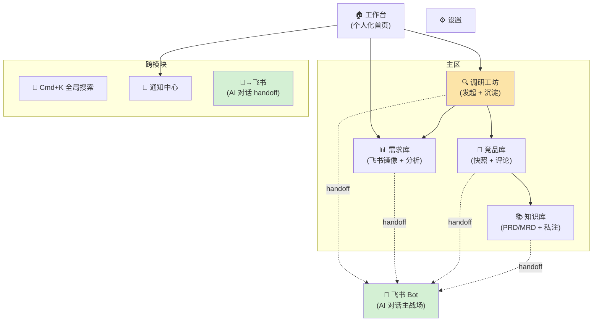
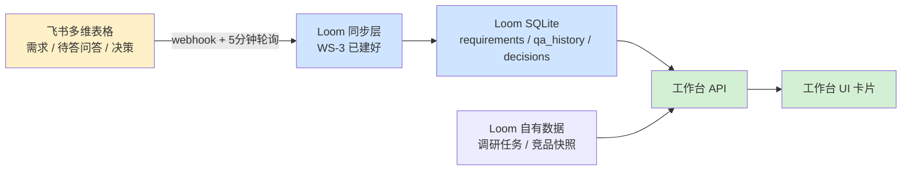
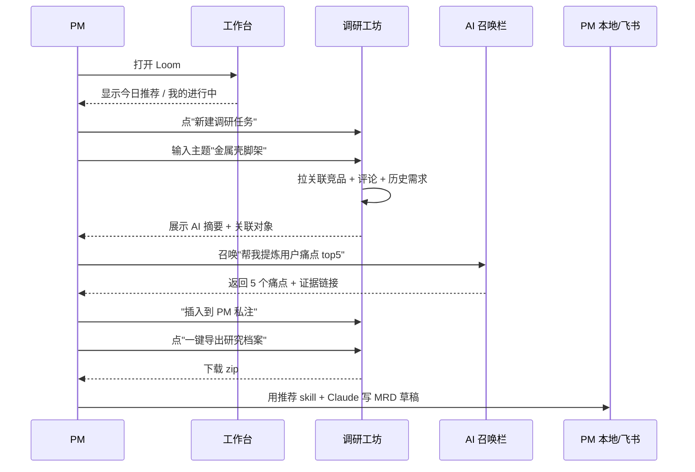
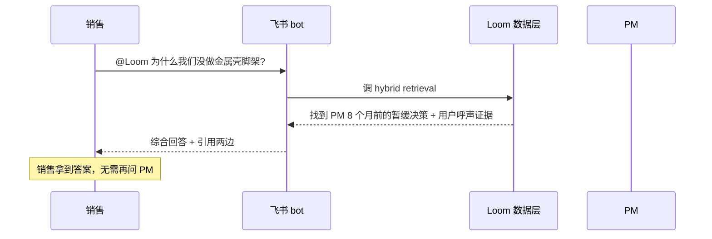
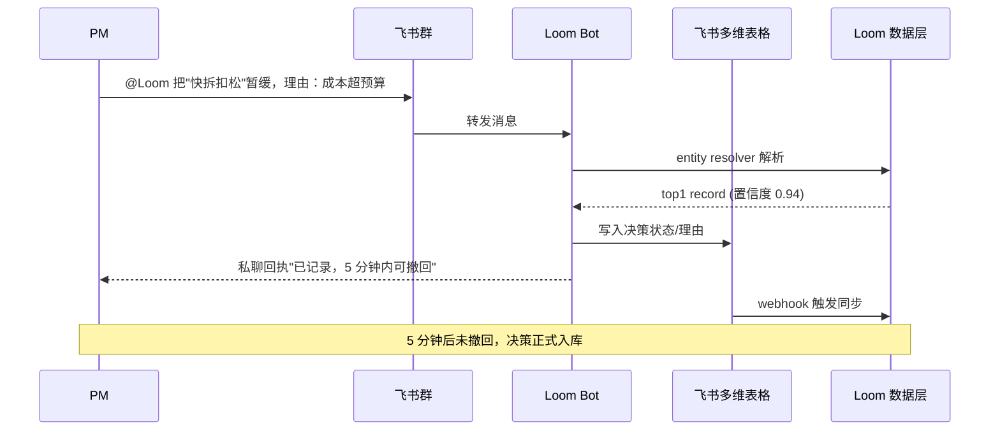

# Loom UI 架构 (Information Architecture)

本文档定义 Loom 网页端的**信息架构**——不是设计稿，是骨架。决定的是"有哪些板块、每个板块做什么、彼此怎么连"，具体像素稿在这之后。

**参考的行业实践**：Linear（任务管理，IA 极简）、Notion（知识库 + 工作区）、Airtable（结构化数据 + 多视图）、Sentry / Datadog（数据聚合仪表盘）。本文档采用的范式：**左侧导航 + 主区** + **跨模块共用组件**——AI 对话不在 web 里做，统一在飞书 bot；web 只做一次性 AI 操作按钮 + "在飞书继续讨论"的 handoff。

**已决议（2026-05-19 round 2）**：
- ✅ 左侧导航（顶部 tab 不够宽）
- ✅ AI 对话**全部归飞书**——web 端不做 chat sidekick；只做"AI 一次性操作按钮"（总结/聚类/提炼）+ "送到飞书继续"
- ✅ "需求工坊" → 改名 "需求库"；砍掉 AI 生成 MRD；保留基础分析（销量 / 价格带 / 重点需求总结）
- ✅ 全局 Cmd+K hybrid 搜索
- ✅ 工作台作为首页
- ❌ 不做手机端（飞书 bot 覆盖移动场景）

---

## 0. 设计原则（贯穿所有模块）

| 原则 | 说明 |
|---|---|
| **PM 在主战场** | UI 服务于 PM 的真实工作流（调研 → 决策 → 写作），不去和 PM 抢任何动作 |
| **飞书是源头** | 凡是飞书已经做的事（需求增删改），Loom 不重做 UI；提供"跳转到飞书"而非"在 Loom 里编辑" |
| **AI 对话在飞书** | Loom web 不做 AI chat 界面——避免与飞书 bot 形成两份割裂的会话历史；web 端只提供"一次性 AI 操作"（总结/提炼/聚类，结果就地展示）和"在飞书继续"的 handoff |
| **关联即洞察** | 每个对象（竞品 / 评论 / 需求 / 调研）都显式展示与其他对象的连接——这是"内外打通"的可视化 |
| **导出优于内编** | 任何 PM 想"带走"的东西都能一键打包导出 |
| **空状态有引导** | 任何空白页都有"下一步做什么"提示，不给 PM 留思考空隙 |

---

## 1. 顶层 IA 图



**说明**：
- 黄色 = PM 在 web 端的核心工作流入口（调研工坊）
- 绿色 = AI 对话发生在飞书 bot，web 通过 handoff 把上下文送过去
- 跨模块组件在所有页面都在
- 注意：**没有"问答助手"网页模块**——所有 AI 对话统一去飞书

---

## 2. 模块详解

### 2.1 🏠 工作台 (Home)

**定位**：登录后的默认页，回答 "我今天要做什么"。**核心是聚合 Loom 自有数据 + 飞书镜像数据，给 PM 一个跨源全景**。

| 维度 | 内容 |
|---|---|
| **功能** | 1. **我的进行中调研** (来源：Loom 自有调研任务表)<br/>2. **团队近 7 天决策动态** (来源：飞书多维表格镜像，过滤 `决策时间 >= 7d`)<br/>3. **待我答的问答** (来源：飞书"待 PM 解答"多维表格镜像)<br/>4. **关注的竞品最新动态** (来源：Loom 爬虫数据，按用户关注列表过滤)<br/>5. **今日推荐调研主题** (来源：AI 计算，基于评论热度 × 团队空白点) |
| **逻辑** | 见下方"工作台数据流"详图 |
| **价值** | PM 打开 Loom 就知道"今天该看什么 / 该做什么"——是聚合飞书 + Loom 两边数据的**唯一统一入口** |
| **行业参考** | Linear Inbox / GitHub Home / Datadog Overview |

**空状态**：新用户进来全是空 → 引导卡片"创建你的第一个调研任务"。

#### 工作台 ↔ 飞书 数据流（详细解释）

这是之前没讲清的地方。工作台**不直接调飞书 API**，而是读 Loom 已经同步好的本地镜像：



**几个关键点：**

1. **工作台是读多源的聚合视图**：飞书镜像表（需求 / 待答问答 / 决策）+ Loom 自有表（调研任务 / 竞品 / 评论）一起出
2. **不在工作台上做任何写操作**——所有"修改"按钮都跳转到对应详情页或飞书表
3. **同步状态可见**：工作台顶部右上角小指示器 "飞书同步：2 分钟前 ✅"——同步失败时变红 + 通知中心告警
4. **卡片点击行为**：
   - "团队最近决策"卡片 → 跳 Loom 内的需求详情页（只读，可在那里看到这条决策关联的所有调研/竞品/评论），那里再有"去飞书编辑"按钮
   - "待我答的问答" → 跳飞书表（因为答问要在飞书表填）
   - "我的进行中调研" → 跳 Loom 调研工坊详情
5. **后台 job**：
   - 同步 job：飞书 → Loom（已在 WS-3 定义）
   - "今日推荐"计算 job：每天凌晨跑一次，基于评论增量和团队覆盖度

**首屏布局草图**（不是视觉稿）：

```
┌──────────────────────────────────────────────────────┐
│ Loom    [Cmd+K 搜索 ____]      🔔   飞书同步 ✅      │
├──────────────────────────────────────────────────────┤
│                                                       │
│  [我的进行中调研 3]    [待我答 2]    [新决策 5]      │
│                                                       │
│  ┌──────────── 团队近 7 天决策动态 ───────────────┐ │
│  │  XX款脚架升级 → 暂缓 (PM 张三, 2天前)          │ │
│  │  YY款手柄硅胶 → 立项 (PM 李四, 4天前)          │ │
│  │  ...                                              │ │
│  └────────────────────────────────────────────────┘ │
│                                                       │
│  ┌──── 我的调研 ───┐  ┌──── AI 推荐主题 ──────┐    │
│  │  ...             │  │  闪光灯散热 (评论 ↑)   │    │
│  └─────────────────┘  └────────────────────────┘    │
└──────────────────────────────────────────────────────┘
```

---

### 2.2 🔍 调研工坊 (Research Workshop)

**定位**：**PM 80% 的时间花在这里**。从"新需求/调研主题"到"导出研究档案"的完整工作流。

| 维度 | 内容 |
|---|---|
| **功能** | 1. 新建调研任务（输入主题 / 关键词 / 产品类目）<br/>2. 调研任务列表（我的 / 团队全部，可筛选）<br/>3. **单任务详情页**（最重要的页）：<br/>　 ├ 关联竞品快照（多个）<br/>　 ├ 关联评论 / 用户声音<br/>　 ├ 关联需求（来自飞书镜像）<br/>　 ├ AI 分析摘要（痛点 top5 / 竞品对比 / 差异化方向）<br/>　 ├ PM 私注区（自由文本，入向量库）<br/>　 ├ **[一键导出研究档案]** 按钮<br/>　 └ **[在 AI 召唤栏继续讨论]** 入口 |
| **逻辑** | 调研任务是"瞬间生成的快照"——发起即采集即整理；不持续追踪；导出后 PM 拿去外部写 PRD/MRD |
| **价值** | 把"我要做新产品"到"我手上有完整研究材料"压缩到分钟级。**这是 Loom 替团队省时间的主战场。** |
| **行业参考** | Notion 项目页 / Linear cycle 详情页 / Coda 文档 |

**关键 UX 决策**：
- 调研任务"详情页"采用**左主右辅**布局：主区是 AI 摘要 + PM 私注（可编辑），右辅是关联对象列表（竞品 / 评论 / 需求，可点击跳详情）
- "一键导出"必须显眼，**就是这个模块的 hero action**
- 详情页右上角有"在 AI 召唤栏继续讨论"按钮——把当前任务的所有关联对象作为上下文加载到 AI 栏

---

### 2.3 📊 需求库 (Demands)

**定位**：**飞书需求多维表格的只读镜像 + AI 增强检索 + 品类分析**。PM 不在 Loom 里编辑需求，但 Loom 比飞书原生更好用——多了语义搜索和品类全景。

| 维度 | 内容 |
|---|---|
| **功能** | 1. 表格视图（镜像飞书字段）<br/>2. 状态筛选 + AI 语义搜索<br/>3. **决策历史时间线**<br/>4. **品类分析视图**（新增，详见下方）<br/>5. **单需求详情页**：<br/>　 ├ 飞书表所有字段<br/>　 ├ 决策状态 / 理由 / 人 / 时间<br/>　 ├ 关联调研任务<br/>　 ├ 关联竞品<br/>　 ├ 相关用户声音<br/>　 ├ **[在飞书表打开]** (编辑跳飞书)<br/>　 └ **[送到飞书 AI 讨论]** (handoff) |
| **逻辑** | 写入永远走飞书；Loom 端只读；编辑跳飞书 |
| **价值** | "这个需求历史决策"一秒答出 + "这个品类的市场全貌"一屏看清。新 PM 入职、写 PRD 引用、品类规划都靠这一页 |
| **行业参考** | Airtable 视图 / Linear roadmap / Notion 数据库 |

#### 品类分析视图（替代被砍掉的 AI 生成 MRD 功能）

当 PM 筛选到某品类（比如"脚架"）时，可以切到"📈 品类分析"视图，看到：

```
┌──── 脚架品类分析（基于 32 个竞品快照 + 458 条需求 + 1,247 条评论）────┐
│                                                                          │
│  💰 价格带分布                                                          │
│      <100元: ████████ 35%      100-300元: ██████████ 42%                │
│      300-500元: █████ 18%      >500元: █ 5%                             │
│                                                                          │
│  📦 销量分布（基于电商抓取数据）                                       │
│      头部 (>1万/月): 4 个竞品                                          │
│      腰部 (1k-1万/月): 12 个竞品                                       │
│      长尾 (<1k/月): 16 个竞品                                          │
│                                                                          │
│  🎯 重点需求 TOP 5（团队记录的需求按关联评论数排序）                  │
│      1. 快拆结构改良（关联评论 87 条，状态：暂缓）                    │
│      2. 重量减轻（关联评论 64 条，状态：立项）                        │
│      3. 金属壳质感（关联评论 41 条，状态：考虑中）                    │
│      ...                                                                 │
│                                                                          │
│  🔥 用户呼声热词（评论 AI 聚类）                                       │
│      "稳定" / "便携" / "卡扣松" / "调节顺滑" / "重量"                 │
│                                                                          │
│  [📤 把这份分析送到飞书 AI 继续讨论]                                  │
└──────────────────────────────────────────────────────────────────────┘
```

**几个关键点：**
- **不是生成 MRD**，是给 PM "看清这个品类在市场上长什么样"——决策前的全景
- 数据来源都是 Loom 已有的：电商爬虫（价格、销量）、评论库（聚类）、需求镜像（重点需求 + 状态）
- 底部的 "送到飞书 AI 继续讨论" 按钮一键把这份分析作为上下文发给 PM 的飞书 bot，PM 在飞书里追问

**关键 UX 决策**：
- 列表视图：表格 / 看板（按状态分列） / 时间线（按决策时间） / **品类分析（新加）**
- **绝对不做"在 Loom 里改字段"** ——所有"编辑"按钮都跳飞书
- 顶部明显标注 "数据来源：飞书《XX 多维表格》｜最后同步：2 分钟前"

---

### 2.4 🏪 竞品库 (Competitors)

**定位**：所有竞品快照的浏览 + 探索 + 标注。是"外部信号"的主仓库。

| 维度 | 内容 |
|---|---|
| **功能** | 1. 按品类浏览（脚架 / 闪光灯 / 手柄...）<br/>2. 按来源筛选（小红书 / 电商平台）<br/>3. **单竞品快照详情页**：<br/>　 ├ 基本信息（标题 / 价格 / 销量等可获取字段）<br/>　 ├ 评论列表 + 评论检索<br/>　 ├ 评论 AI 聚类（痛点 / 称赞点）<br/>　 ├ **PM 标注 / 私注** 区（团队共建）<br/>　 ├ 关联调研任务 / 关联需求<br/>　 └ "添加到调研任务" 按钮<br/>4. 全局评论检索（跨竞品搜 "卡扣松"，列出所有提到的原话） |
| **逻辑** | 竞品快照是时间戳数据；同一个产品 URL 多次抓取会生成多个快照；PM 标注永久绑定到 record（snapshot 间共享） |
| **价值** | "用户在抱怨什么"——可视化呈现 + 可搜索。**评论检索功能是高频被使用的 killer feature**（销售也用、PM 也用） |
| **行业参考** | Algolia 搜索界面 / Sentry issues 列表 / 电商商品详情页 |

**关键 UX 决策**：
- 评论是最有价值的部分——单独做一个"评论检索"全局入口，不要藏在竞品详情里
- PM 标注做成"全员可见 + 标注者可改"——这是团队记忆的载体

---

### 2.5 📚 知识库 (Knowledge Base)

**定位**：历史 PRD / MRD / 培训文档 / 已答问答的归档 + 向量索引——内部上下文的载体。

| 维度 | 内容 |
|---|---|
| **功能** | 1. 文档列表（按产品 / 按类型 / 按时间）<br/>2. 单文档查看（渲染 markdown / 飞书文档嵌入）<br/>3. AI 语义搜索（"和闪光灯散热相关的文档"）<br/>4. 内部问答历史浏览（已答的问题 + 答案 + 来源）<br/>5. 上传文档入向量库（管理员） |
| **逻辑** | 文档切块 → embedding → sqlite-vec；查询时检索 top-k chunk 喂给 LLM |
| **价值** | "我们公司的内部上下文" 的可视化呈现。也是内部问答 bot 的数据源——让 PM 看得到"AI 在用什么材料回答" |
| **行业参考** | Notion 文档 + AI 搜索 / Glean / Mendable |

**关键 UX 决策**：
- 文档来源可以是上传（admin）或自动从飞书拉取（如果飞书云文档授权）
- 搜索结果展示带高亮的 chunk 片段，让 PM 看到"AI 找到了哪一段"

---

### 2.6 ⚙️ 设置 (Settings)

略。常规配置项：飞书集成、爬虫数据源、团队成员、Skill 推荐管理、Embedding/LLM 配置。

---

## 3. 跨模块组件（在所有页面都在）

这些是"基础设施级"UI，每个模块都依赖。

### 3.1 🔎 全局搜索栏（顶部）

**位置**：所有页面顶部居中，`Cmd+K` 唤起。

**功能**：
- 一个输入框，混合搜：调研任务 / 需求 / 竞品 / 评论 / 文档
- 结果分组展示，每组 top 3
- 支持自然语言：「快拆松的脚架」会同时返回相关竞品 + 相关评论 + 相关需求
- Hybrid retrieval（关键词 + 向量）

**价值**：避免 PM 想"这事在哪个模块"——全部从搜索框进。

**行业参考**：Linear Cmd+K / Notion 全局搜索 / Raycast

---

### 3.2 🤖 AI 操作 + 飞书 Handoff（不是 chat 栏）

**重要：Loom web 不做 AI chat 界面**——避免和飞书 bot 形成两套割裂的会话历史。Loom web 端的 AI 能力分两类：

#### 3.2.1 一次性 AI 操作按钮（就地展示，无 chat）

针对具体页面上的具体数据，按一下跑一次 agent，结果就地展示，**不进 chat 流**。

| 位置 | 按钮 | 做什么 |
|---|---|---|
| 竞品详情页 | "🎯 聚类此竞品评论痛点" | 跑一次 LLM 聚类，结果显示在评论 tab 顶部 |
| 竞品详情页 | "✨ 提炼卖点 / 痛点" | 输出两个 bullet list，可一键复制 |
| 调研任务详情 | "🔍 跨竞品对比" | 自动生成对比表 |
| 调研任务详情 | "📝 生成研究档案摘要" | 写入 `summary.md`，导出包用到 |
| 需求库品类分析 | "🔥 提炼用户呼声热词" | 词云 + 关键词列表 |
| 知识库文档详情 | "📋 文档总结 3 句话" | 顶部显示 TL;DR |

**特点：**
- 每个按钮 = 一次 agent 调用，**确定的输入 → 确定的输出**
- 结果是结构化数据（list / table / text block），不是对话
- 没有"接着问"——想接着问就用下面 3.2.2 的 handoff

#### 3.2.2 "送到飞书继续讨论" Handoff 按钮

放在所有详情页的右上角，按钮文案：「💬 在飞书继续讨论」。

**点击行为：**
1. 后端打包当前页的关键上下文（调研任务 ID / 竞品 ID / 当前 AI 操作结果等）
2. 通过飞书 API 给 PM 的"Loom bot 私聊频道"发一条消息：
   > 你在 Loom 看了《XX 款脚架快拆调研》。我已经把以下数据加载为上下文：[3 个关联竞品] [87 条相关评论] [上次的痛点聚类结果]。想问什么？
3. PM 一键切到飞书（如果设置允许，可直接深链接 `feishu://...` 打开），在飞书里继续
4. **整段对话只发生在飞书** ——历史在飞书可搜可回看

**价值：**
- **一份 AI 会话历史**（飞书），不要在两个地方都留聊天记录
- **上下文不丢**——从 web 转移到飞书时，AI 已经"知道你在看什么"
- Loom web 保持轻量，专注数据探索；对话能力在 PM 已经习惯的飞书里

**行业参考**：Gmail / Calendar "在 Slack 里讨论" / Linear "send to Slack" / Figma "open in chat"——这是 SaaS 跨产品的标准 handoff 模式

---

### 3.3 🔔 通知中心（顶部铃铛）

**功能**：
- 团队决策动态（@我相关）
- 路由到我的待答问答
- 同步异常告警（飞书表同步失败等）
- bot auto-write 的撤回窗口提示

**价值**：让 PM 不需要常驻 Loom 也能被关键事件触达。

---

## 4. 核心用户流（User Flows）

### Flow A：PM 从新想法到导出 MRD 草稿



### Flow B：销售问"为什么我们没做 X"



### Flow C：PM 在飞书里 @ bot 暂缓需求



---

## 5. 当前实现 vs 目标 IA 的 gap

| 模块 | 现状 | 目标 IA | Gap |
|---|---|---|---|
| 工作台 | 不确定是否有 | 个人化首页（聚合飞书镜像 + Loom 自有） | 需新建 |
| 调研工坊 | ✅ 有 | 加"一键导出" + 一次性 AI 操作按钮 + 飞书 handoff | 增强 |
| 需求工坊 → 需求库 | ✅ 有但偏 AI 生成 | 改为飞书镜像 + 决策时间线 + **品类分析视图**，**砍掉 AI 生成 MRD** | 重定位 + 砍 + 加品类分析 |
| 竞品库 | 部分有 | 加全局评论检索 + PM 标注 + 一次性 AI 聚类按钮 | 增强 |
| 知识库 | 不确定 | 文档 + 向量检索 | 多半要新建 |
| ~~问答助手~~ | — | **砍掉**——AI 对话统一去飞书 | 不做 |
| ~~AI 召唤栏~~ | — | **砍掉**——AI 对话统一去飞书 | 不做 |
| 一次性 AI 操作按钮 | 没有 | 散布在各详情页 | 新增（轻量） |
| 飞书 Handoff 按钮 | 没有 | 各详情页右上角 | 新增（需飞书 API 配合） |
| 全局搜索 | 不确定 | Cmd+K hybrid 搜索 | 新建 |
| 通知中心 | 不确定 | 铃铛 + 抽屉 | 新建 |

**核心变更总结**：
1. 砍掉"AI 召唤栏 / 问答助手" web 端模块——AI 对话全部归飞书
2. 需求工坊改名 → 需求库，砍 AI 生成 MRD，加品类分析视图
3. 加"一次性 AI 操作按钮"（散布各详情页）+ "飞书 Handoff 按钮"

---

## 6. 还待确认的细节

5 个方向性问题都已经定（见文档开头"已决议"）。剩下的是细节问题，不阻塞 wireframe 启动：

1. **"品类分析"的数据足够吗？** 销量数据依赖电商抓取——如果某些品类抓不到销量，相应卡片要降级显示"暂无数据"，不要硬撑
2. **飞书 Handoff 的"上下文打包格式"**：当前用 markdown 拼一段文字发到飞书。如果飞书 bot 想做更结构化的输入（比如把竞品 ID 直接作为参数传），需要 bot 端配合解析——这个决定由 bot 端架构定
3. **"一次性 AI 操作按钮"按完结果保留多久？** 建议存到当前对象上（比如评论聚类结果存到竞品 record），下次打开还在，PM 也能手动刷新

这三个不影响 wireframe 设计；可以在实现阶段定。

---

*文档版本：v1 (2026-05-19)*
*配套：[competition-roadmap.md](./competition-roadmap.md)*
